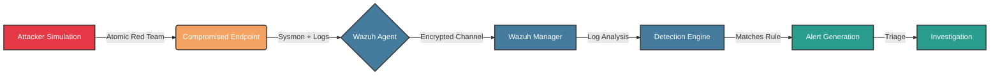

# 🛡️ SOC Detection Engineering & Adversary Emulation Lab


**A practical implementation of a Home Lab SIEM tailored for Threat Hunting, Detection Engineering, and Incident Response.**

---

## 📖 Overview
This repository documents a hands-on **SOC detection engineering environment** built to simulate enterprise-grade security monitoring. The lab integrates **Wazuh SIEM**, **Sysmon**, and **Atomic Red Team** to generate, ingest, and detect real-world adversary behaviors mapped to the MITRE ATT&CK framework.

Unlike theoretical study, this project focuses on the **Detection Engineering Lifecycle**: simulating attacks, analyzing raw telemetry, writing custom XML rules, and tuning for false positives.

## 🏗️ Lab Architecture

### Core Components
| Component | Technology | Purpose |
| :--- | :--- | :--- |
| **SIEM** | **Wazuh** | Log aggregation, correlation, and alerting. |
| **Telemetry** | **Sysmon + WinEventLog** | Granular endpoint visibility (Process creation, Network connections). |
| **Simulation** | **Atomic Red Team** | Executing mapped TTPs (Techniques, Tactics, and Procedures). |
| **Forensics** | **Autopsy, Wireshark** | Post-incident artifact analysis. |

### Data Flow Diagram


---

## 🎯 Detection Engineering Workflow

This lab follows a standardized **SOC detection pipeline**:

1. **Simulation** — Execute MITRE ATT&CK techniques using Atomic Red Team  
2. **Ingestion** — Validate log forwarding and agent telemetry in Wazuh  
3. **Analysis** — Identify Indicators of Attack (IOAs) using Sysmon & Security logs  
4. **Development** — Build Wazuh XML rules and correlation logic  
5. **Validation** — Re-run attack to confirm alert triggering  
6. **Tuning** — Reduce false positives and administrative noise  

---

## 🔍 Active Detections

| Tactic | ID | Technique | Data Source | Status |
-------|----|----------|-------------|--------
Credential Access | T1003 | LSASS Memory Dumping | Sysmon Event ID 10 | 🟢 Active  
Execution | T1059 | Obfuscated PowerShell | ScriptBlock Logs | 🟢 Active  
Defense Evasion | T1070 | Clear Event Logs | Security Event ID 1102 | 🟢 Active  

---

## 🚀 Detection Roadmap

Planned detection expansion:

- **Lateral Movement** — T1550 (Pass-the-Hash)  
- **Command & Control** — T1071 (Beaconing Detection)  
- **Ransomware Behavior** — T1490 (Shadow Copy Deletion)  

---

## 📂 Repository Structure

```bash
SOC-Detection-Lab/
├── credential_access/
│   └── T1003_credential_dumping.md
├── execution/
│   └── T1059_powershell_detection.md
├── persistence/
├── lateral_movement/
├── command_and_control/
├── ransomware/
├── diagrams/
├── screenshots/
└── README.md
```

---
## 📝 Documentation Standard

Each detection case includes:

- Attack description  
- Log evidence and telemetry analysis  
- Detection logic (Wazuh XML / correlation)  
- Alert proof screenshots  
- False positive tuning notes  

This mirrors **enterprise SOC documentation standards**.

---

## 🧠 Skills Demonstrated

- SIEM rule engineering and alert tuning  
- Endpoint telemetry analysis (Sysmon)  
- SOC alert triage and investigation  
- MITRE ATT&CK technique mapping  
- Digital forensics and evidence handling  

---

## 🏆 Certifications

🎖️ **Blue Team Level 1 (BTL1) — Gold Coin Distinction**  

Awarded for achieving **90%+ score** on a 24-hour hands-on SOC incident response exam.

---

## ⚠️ Disclaimer

All adversary simulations are conducted in **isolated sandbox environments** strictly for educational and defensive research purposes.  
❌ No production systems were targeted.

---

## 📬 Contact

**👤 Mohammad Alquamah**  
SOC Analyst | Detection Engineering Enthusiast  

- 🔗 LinkedIn: https://linkedin.com/in/mohammad-alquamah
- 💻 GitHub: https://github.com/alquamah-blue 


