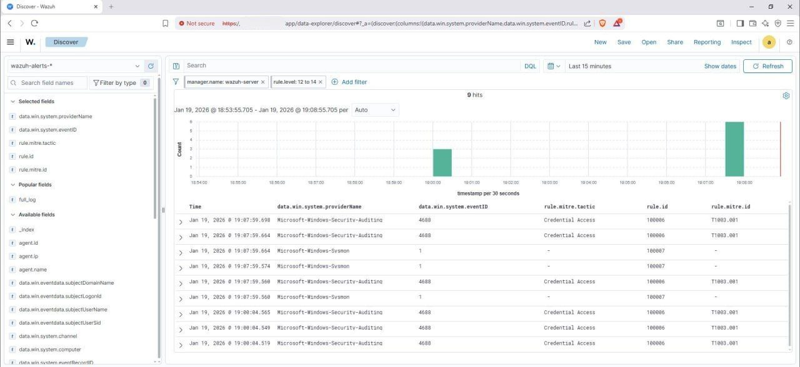

# 🛑 T1003 — Credential Dumping Detection (Process Creation Based)

---

## 📖 Overview

This detection focuses on identifying **credential dumping activity** by monitoring suspicious process execution behavior related to LSASS dumping utilities.

In this lab environment, detection is implemented using **Sysmon Event ID 1 (Process Creation)** telemetry and command-line pattern matching. While this approach does not directly monitor LSASS memory access, it represents a realistic **Tier-1 SOC detection method** that provides early-stage visibility into credential access attempts.

This detection was validated using adversary emulation via Atomic Red Team.

---

## ⚔️ Attack Simulation

**Simulation Tool:** Atomic Red Team  

**MITRE ATT&CK Technique:**  
- **T1003 — OS Credential Dumping**

### Simulation Summary

Atomic Red Team was used to execute credential dumping simulations that invoke LSASS dumping tools (such as Procdump) with LSASS specified as the target process. This activity generated observable process creation telemetry used for detection validation.

---

## 📊 Telemetry Source

### Primary Log Source

- **Sysmon Event ID 1 — Process Creation**

### Relevant Fields Used

- `win.eventdata.image`  
- `win.eventdata.commandLine`  
- `win.eventdata.parentImage`  
- `win.eventdata.user`  

These fields provide visibility into suspicious binary execution and command-line arguments commonly associated with credential dumping behavior.

---

## 🎯 Detection Logic

### Detection Objective

Detect suspicious execution of LSASS dumping utilities by identifying known credential dumping patterns in process command-line arguments.

---

### Behavioral Logic (High-Level)

```text
IF process command line contains known LSASS dumping patterns
AND process is not a trusted Windows system binary
THEN generate alert for potential credential dumping activity
```

This approach enables early-stage detection of credential dumping attempts using readily available endpoint telemetry.

---

## 🛠️ Wazuh Detection Rule

The following custom rule was implemented inside `local_rules.xml` to detect Procdump-based LSASS dumping behavior:

```xml
<rule id="100086" level="12">
  <if_sid>61603</if_sid>
  <field name="win.eventdata.commandLine" type="pcre2">(?i)procdump.*lsass</field>
  <description>Credential Dumping Detected: Procdump utility targeting LSASS process</description>
  <mitre>
    <id>T1003.001</id>
  </mitre>
  <group>atomic_red_team,t1003</group>
</rule>
```

### Rule Explanation

- Uses **case-insensitive regex matching**  
- Targets Procdump execution with LSASS as argument  
- Maps detection to **MITRE sub-technique T1003.001**  
- Tagged for Atomic Red Team testing correlation  

---

## ✅ Validation Results

**Alert Triggered:** Yes  

### Validation Method

- Atomic Red Team simulation executed  
- Sysmon Event ID 1 generated process creation logs  
- Wazuh successfully matched detection logic  
- Alert generated and visible in dashboard  

This confirms the detection logic is functioning as expected in the lab environment.

---

## 📸 Evidence

The following screenshot shows the alert generated in the Wazuh dashboard:



---

## ⚠️ Known Limitations

This detection has the following limitations:

- Relies on command-line pattern matching  
- Can be bypassed using renamed or custom dumping tools  
- Does not directly monitor LSASS memory access (Sysmon Event ID 10)  
- Signature-based logic requires continuous tuning  

These limitations are common in entry-level SOC detection pipelines and require layered detection improvements.

---

## 🧪 False Positive Considerations

Potential benign activity that may trigger this detection:

- Legitimate administrative troubleshooting tools  
- Endpoint security software performing memory analysis  
- Authorized forensic utilities  

Such alerts require contextual investigation during SOC triage.

---

## 🚀 Improvement Plan

Planned enhancements to strengthen detection coverage:

- Add **Sysmon Event ID 10 (Process Access)** telemetry  
- Implement **digital signature verification checks**  
- Add **parent-child process relationship analysis**  
- Correlate with abnormal authentication activity  
- Expand detection logic beyond Procdump  

---

## 🗺️ MITRE ATT&CK Mapping

| Tactic | Technique | ID |
|-------|----------|----|
| Credential Access | OS Credential Dumping | T1003 |

---

## 📝 Notes

This detection represents a foundational **SOC detection engineering implementation** demonstrating endpoint telemetry analysis, SIEM rule creation, alert validation, and professional documentation practices. Future iterations will improve behavioral coverage and detection reliability.


